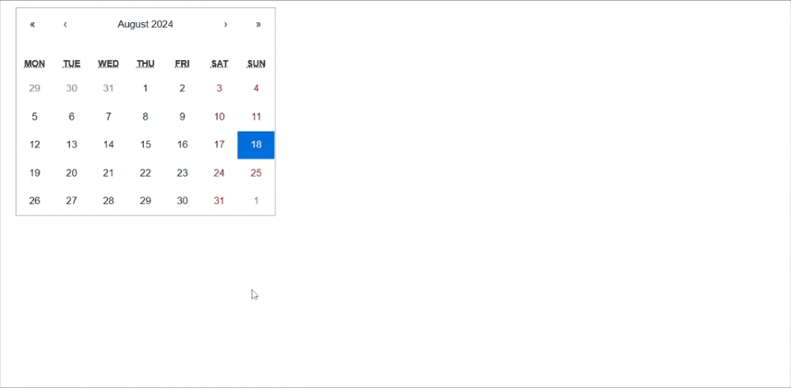
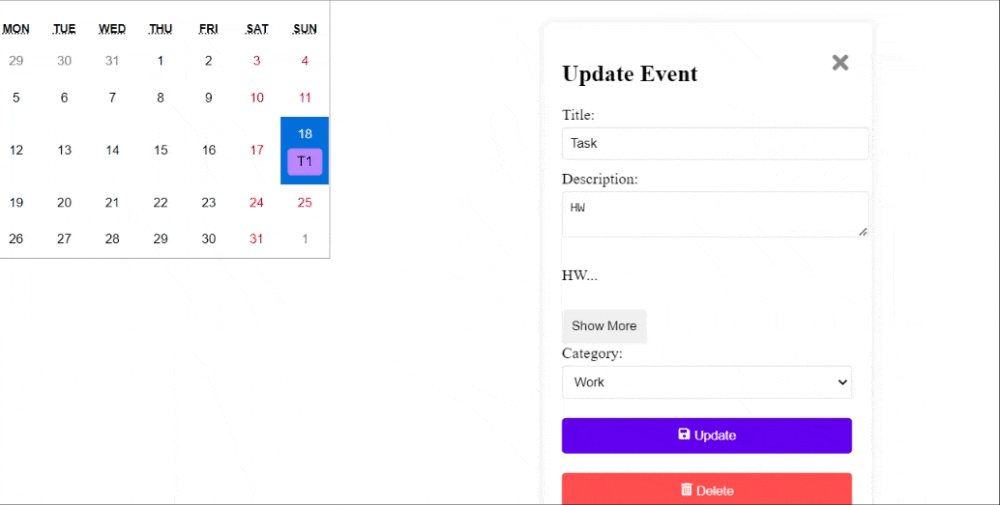

# Calendar Event Application

This is a React-based Calendar Application. The application allows users to view, add, edit, and delete events. The app is built with React, uses state management with the Context API, and is styled with CSS modules.

## Demo 





## Features

- **Calendar View:** Displays a monthly calendar with events.
- **Add Event:** Form to add a new event to the calendar.
- **Edit Event:** Modify details of an existing event.
- **Delete Event:** Remove an event from the calendar.
- **Event Details:** View details of an event by clicking on it.
- **Filter Events:** Filter events by category (e.g., Work, Personal).

## Technologies Used

- **React** for building the user interface.
- **React Router** for client-side routing.
- **Context API** for state management.
- **Vite** for development and build tooling.
- **CSS Modules** for scoped styling.

## Getting Started

### Prerequisites

- Node.js (version 14 or higher)
- npm (version 6 or higher)

### Installation

1. Clone the repository:
   ```bash
   git clone https://github.com/MehekFatima/Calendar-Event.git
2. Go to the project directory:
   ```bash
   cd Calendar-Event
3.Install dependencies:
   ```bash
   npm install
```

4.Start the development server:
  ```bash:
      npm run dev
```


